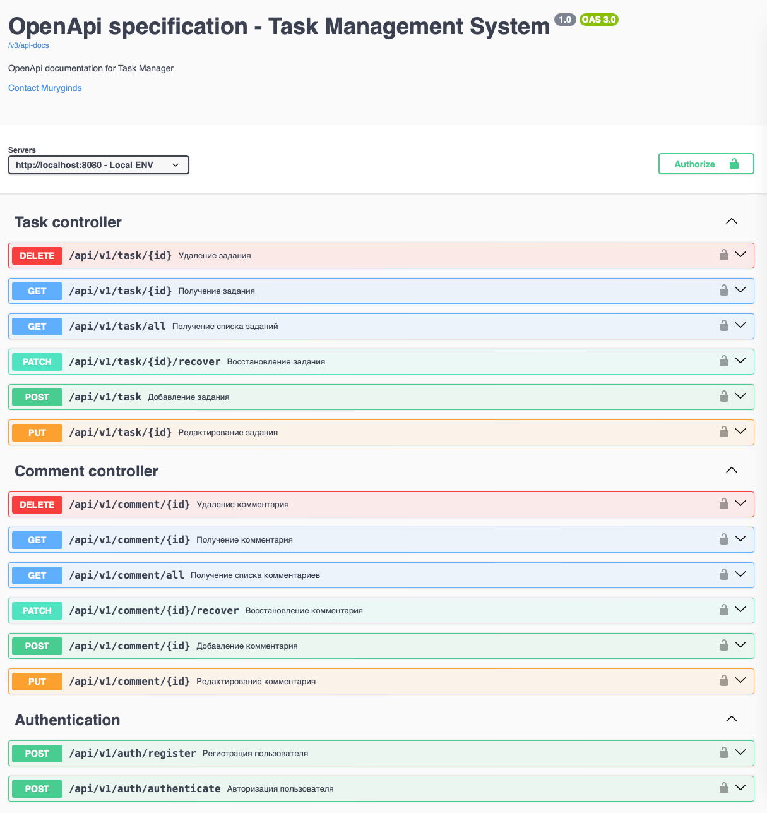

## Task Management System (Система управления задачами)

Сервис обеспечивает создание, редактирование, удаление и просмотр <b>задач</b> и <b>комментариев</b> к ним.

Особенности:
- JWT аутентификация
- Argon шифрование (bouncycastle)
- REST API
- Валидация входящих данных
- Liquibase миграции
- Управление ошибками с помощью ControllerAdvice
- OpenAPI + Swagger документация
- Dev окружение через Docker compose
- Юнит тесты

Технологический стек:
- SpringBoot 3.2.0 (Web, Security, Data, Validation, Test)
- Java 21
- Lombock + Mapstruct
- PostgreSQL
- Liquibase
- OpenApi + Swagger UI

Доступ к документации Rest API осуществляется по адресу http://localhost:8080/swagger при запущенном проекте
или с помощью файла openapi.json в корне проекта. 



Запуск проекта:
- через docker compose:
  <br>нужно ввести команду в корне проекта (создасться все необходимое окружение, включая базу данных)
  <br>```docker-compose up -d```
- с использованием maven wrapper (необходимо будет создать базу данных вручную)
  <br>```./mvnw clean install```
  <br>```./mvnw spring-boot:run```